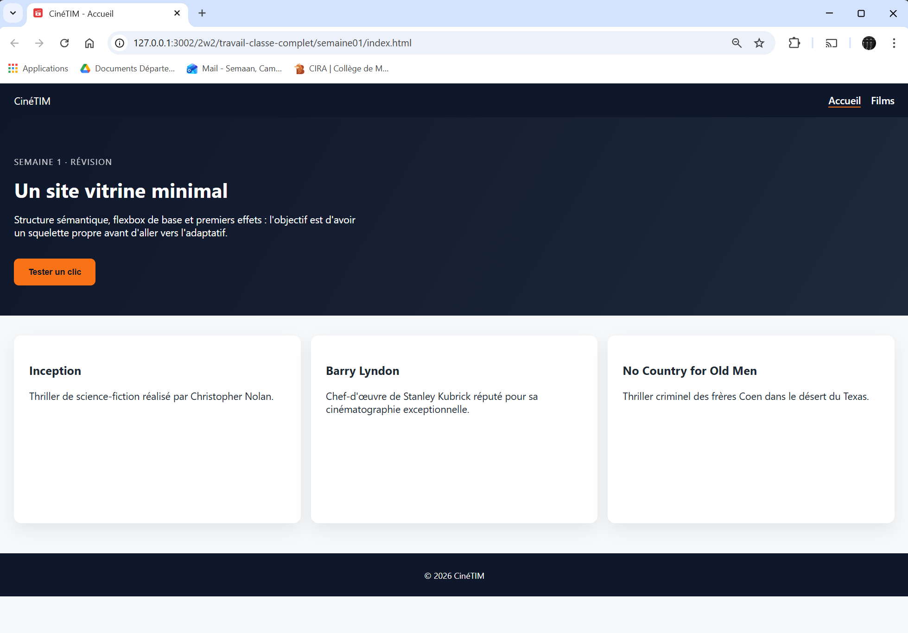
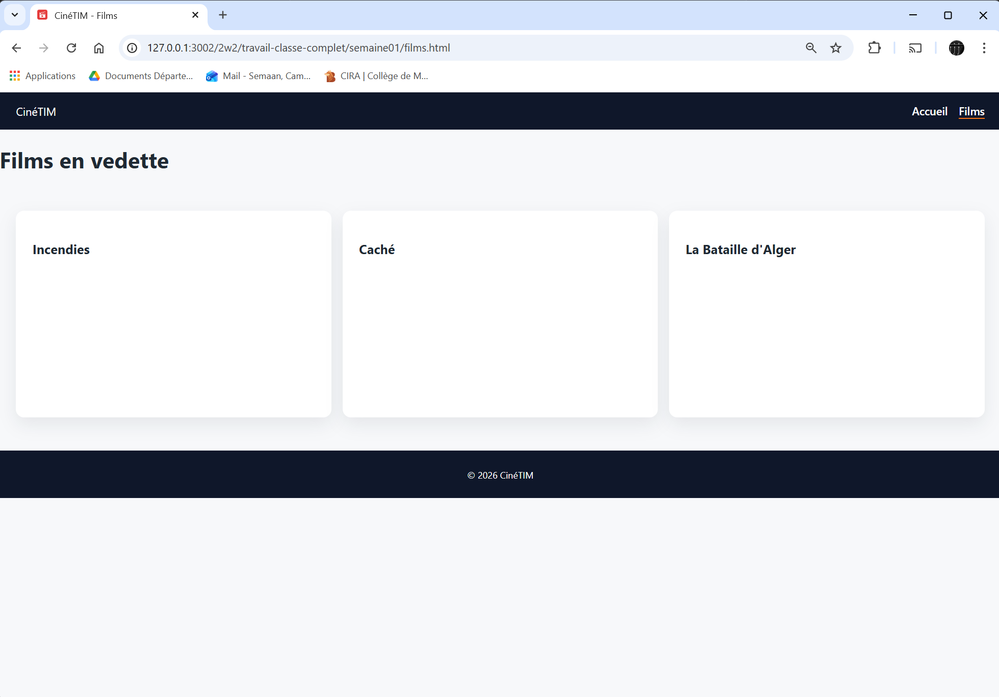

# Semaine 1 – Révision bases HTML/CSS/JS

Objectifs
- Réviser la structure HTML5 sémantique (header/nav/main/footer, section/article)
- Réviser flexbox, sélecteurs, transitions/transformations CSS (simple et plus complexe)
- Manipulation minimale du DOM (`querySelector`, événements de souris, modification du style d'un élément)

Captures d'écrans pour la mise en page à réaliser :
- Page d'accueil
    
- Page des films
    

> Consultez le sommaire de la matière vue dans le cours cette semaine : [s01-sommaire-du-cours.md](s01-sommaire-cours.md)